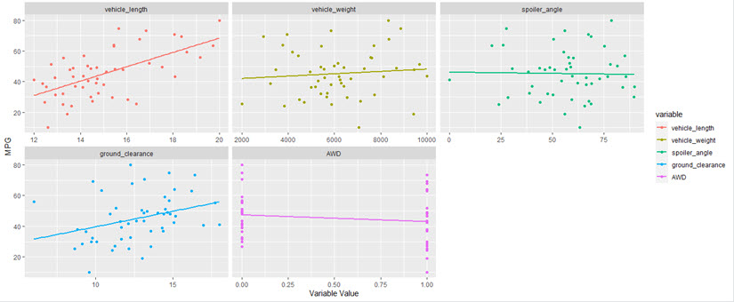
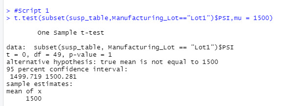

## Overview Of Project
Jeremy has worked for AutosRUs for 10 years and has recently become the primary analyst of the data analytics team. Using historical data to perform retrospective analysis, analytical validation and verification of current automotive specifications and study design of future product testing, the data analytics team is tasked with analyzing AutosRUs' newest prototype, the MechaCar. Their analysis will provide insights to help the manufacturing team. The analysis will:

- Perform multiple linear regression analysis to identify which variables in the dataset predict the mpg of MechaCar prototypes
- Collect summary statistics on the pounds per square inch (PSI) of the suspension coils from the manufacturing lots
- Run t-tests to determine if the manufacturing lots are statistically different from the mean population
- Design a statistical study to compare vehicle performance of the MechaCar vehicles against vehicles from other manufacturers. 
***

## Tools
- R and RStudio
- Packages: tidyverse, dplyr, ggplot2, reshape2
***

## Statistical Results

### Linear Regression to Predict MPG

Using the MechaCar_mpg.csv file with mpt test results for 50 prototype MechaCars, linear regression was used to predict the mpg of the prototypes using several different variables. Variables included several metrics, such as vehicle length, vehicle weight, spoiler angle, drive train, and ground clearance.

The MechaCar_mpg.csv was read into a data frame. Then using the dplyr package, linear regression was performed to pass in all six variables.

Then using the summary() function, we determined the p-value and the r-squared values.

Assuming a .05 significance level, the individual p-value results show that the vehicle weight, spoiler angle and the all wheel drive variables are greater than our significance level. They are statistically likely to provide random amounts of variance to the linear model. Therefore, for these variables there is sufficient evidence **not to reject** the null hypothesis. There is not a significant difference in the dependent variable (mpg) between spoiler angle or all wheel drive. **Vehicle weight, spoiler angle and all-wheel drive do not appear to have a significant effect on mpg.**

On the other hand, vehicle length and ground clearance all show p-value results lower than our significance level. They are statistically unlikely to provide random amounts of variance to the linear model. Therefore, for these variables there is sufficient evidence **to reject** the null hypothesis. There is a significant difference in the dependent variable (mpg) and the vehicle length, weight and ground clearance. **Vehicle length and ground clearance have a significant effect on mpg.**

The r-squared value is .71, which means that roughly 71% of the variability of the mpg predictions may be explained using this model. Overall, this model does a good job of predicting the prototypes. The p-value for this model is 5.35e-11

Graphing data can provide a clearer way to interpret the data. The plot below shows that vehicle length and ground clearance do provide a significant difference on the mpg, while vehicle weight, spoiler angle and AWD do not.

***

### Summary Statistics on Suspension Coils

For this part of the analysis, the Suspension_Coil.csv dataset was used to determine if the manufacturing process was consistent across multiple production lots for suspension coils. 

Using the summarize() function, a data frame was created that shows the mean, median, variance, and standard deviation of the suspension coil’s PSI.

The resulting total_summary data frame is shown below.

Then a summary data frame was created using group_by() and summarize() functions to group each manufacturing lot by the mean, median, variance and standard deviation of the suspension coil's PSI.

The resulting lot_summary data frame is shown below.

The design specifications for the MechaCar suspension coils say that the variance of the suspension coils must not exceed 100 pounds per square inch. From the total_summary data frame, the variance for the PSI is 62.29, so overall for the three lots the variance is within the 100 pounds per square inch variance requirement.

When we look in more detail, however, there seems to be a problem with one of the lots. The variance for Lots 1 and 2 in the lot_summary table are 0.98 and 7.47, respectively. Thse two lots are not statistically different from the population mean of 1,500 pounds per square inch. It is apparent that there is a problem with Lot 3, however. The variance is 170.29.

The box plot below shows the issues with the outliers for Lot 3. These coils do not meet the requirements for PSI for AutosRUs. This lot is statistically different from the population mean of 1,500 pounds per square inch.

In summary, the current manufacturing data shows that while overall the company meets the design specification that the variance of the suspension coils cannot exceed 100 pounds per square inch, individual lots do not meet this requirement. Lots 1 and 2 meet the requirement, but the variance for lot 3 is greater than 100.

### T-Test on Suspension Coils

A t-test was performed on the overall manufacturing lots and on each individual lot to determine if overall and individually by lot they were statistically different from the population mean of 1,500 pounds per square inch.

**Overall T-Test**

This t-test compares all manufacturing lots to the mean population PSI of 1,500. The overall mean of the sample is 1498.78, which is very close to the population mean of 1,500. Assuming a significance value of .05, the in this test is p-value is 0.06, which is higher than the .05 significance level. Because of this, we can conclude that there is sufficient evidence **not to reject** the null hypothesis. There is not a significant difference between the mean population of 1,500 and the sample mean these three lots.

**Lot 1 T-Test**

For Lot 1, the mean is exactly 1500, which is equal to the population mean of 1500. The p-value for Lot 1 is 1. This is higher than the .05 significance level. We can conclude that there is sufficient evidence **not to reject** the null hypothesis. There is not a significant difference between the mean population and the mean for Lot 1. For this lot, the results are **not** statistically different from the population mean of 1,500 pounds per square inch. 

**Lot 2 T-Test**

For Lot 2, the mean is 1500.2. The p-value for Lot 2 is 0.61. This is higher than the .05 significance level. We can conclude that there is sufficient evidence **not to reject** the null hypothesis. There is not a significant difference between the mean population and the mean for Lot 2. For this lot, the results are **not** statistically different from the population mean of 1,500 pounds per square inch. 

**Lot 3 T-Test**

For Lot 3, the mean is 1496.14. The p-value for Lot 2 is 0.04. This is less than the .05 significance level. We can conclude that there is sufficient evidence **to reject** the null hypothesis. There is a significant difference between the mean population and the mean for Lot 2. For this lot, the results **ARE** statistically different from the population mean of 1,500 pounds per square inch. The manufacturing process should be examined to see what happened in the production of this lot that caused the variance.

An additional summary table showing the maximum and minimum for each of the three lots shows that for Lot 3 there is a minimum result of 1452 PSI and a maximum result of 1542 PSI, while the mean is 1498.78 for the three lots combined. If you were just looking at the overall mean of the three lots, these outliers for lot 3 would offset each other (one is a high number, one a low number, both would average out to be close to the overall population mean). 

The resulting lot_summary data frame is shown below.

***

### Design a Study Comparing the MechaCar to the Competition

There are other metrics that AutosRUs can use to study how well MechaCar might perform compared to the competition. Consumers have a wide variety of choices in the automotive world. People choose different cars for different reasons, i.e., compact car for navigating urban streets vs. a minivan for family use. Three primary factors that are important to all customers are: 

1. Price
2. Safety record
3. Reliability rating, i.e., will the car have a multitude of mechanical problems or is it a solid vehicle that needs very little maintenance

Other features that could have an effect on a consumer's decision are:

1. Reputation of Manufacturer
2. Safety Features, i.e., lane departure system,  system for monitoring blind spots of rear-view mirrors and rear cross-traffic, as well as high beam automatic switching system, type of airbags, emergency braking
3. Ride/handling, i.e., sporty vs smooth ride
4. Drive train
6. Size of Engine
7. Luxury features, i.e., keyless entry, remote start, entertainment, navigation system, sunroof, tinted windows, foldable chairs, leather seats, heated seats
8. MPG
9. Electric vs Gas
10. Interior space

**Metric**

Since there are so many possibilities to evaluate, we will limit our study to reliability ratings.

**Design**

The data will come from a customer satisfaction survey for MechaCar showing reliability ratings for different systems in their automobiles over the past 5 years. The data will be broken out by class of vehicle, i.e., all small SUVs, mid-size SUVs, large SUVs, etc. The data will be rated on a scale from 1=very unreliable to 5 = very reliable and will be compared to the population mean of industry standard data for other manufacturers.

**Hypotheses**

1.	H0 : There is no statistical difference between the observed sample mean and its presumed population mean.
2.	Ha : There is a statistical difference between the observed sample mean and its presumed population mean.

**Item Ratings**

The items to be rated by the respondents are as follows:

1. engine
2. transmission
3. climate system
4. brakes
5. elecrical system
6. power accessories

**Type of Statistical Test**: Multiple one-sample t-test

This test will look at whether the mean data of the MechaCar is different from the industry standard data (population mean). The data will be grouped by class first prior to comparing item data. This test will be used to determine whether two numbers are significantly different from each other. By using these t-tests, MechaCar will be able to evaluate whether individual items in their car lineup provide outstanding reliability or whether they need to adjust their manufacturing process to increase the quality of their automobiles. The goal would be to have a rating that is significantly higher than the industry standard mean for each class.
